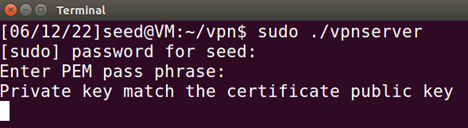
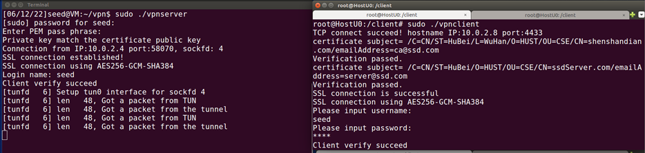

# 使用说明

首先，VPN网关使用`sudo ./vpnserver”`运行VPN服务端程序，输入CA的公钥验证自己的身份（我的PEM是201911729）。

当输入正确时，会显示“Private key match the certificate public key”，然后进入等待客户端连接的状态；输入错误时会退出程序。如下图所示：

客户端使用`sudo ./vpnclient`运行VPN客户端程序，并输入用户名和密码建立连接。当用户名密码输入正确时，会成功建立连接如下图所示：

